# Credit Default Prediction: Explainable, Calibrated and Audited

A credit-card lender wants to predict which customers will **miss their next payment**, so it can intervene early (adjust limits, offer payment plans) **without unfairly penalising any group**.

This project goes beyond "XGBoost got 82% accuracy". It builds a strong model and then **justifies, calibrates and audits it**, which is what regulated industries such as banking and insurance care about.

> **Status:** portfolio project on public 2005 Taiwanese data. It is **not** a production credit model. See [Limitations](#limitations) and the [Model Card](MODEL_CARD.md).

---

## Table of contents

1. [Key results](#key-results)
2. [Dataset and data quality](#dataset-and-data-quality)
3. [Approach](#approach)
4. [Results in detail](#results-in-detail)
   - [Baseline and feature engineering](#1-baseline-and-feature-engineering)
   - [Imbalance handling](#2-imbalance-handling)
   - [Final model performance](#3-final-model-performance)
   - [Calibration](#4-calibration)
   - [Cost-based threshold](#5-cost-based-decision-threshold)
   - [Explainability (SHAP)](#6-explainability-shap)
   - [Fairness audit](#7-fairness-audit)
   - [Failure analysis](#8-failure-analysis)
5. [Key design decisions](#key-design-decisions)
6. [Limitations](#limitations)
7. [Reproduce it](#reproduce-it)
8. [Repository structure](#repository-structure)
9. [References](#references)

---

## Key results

Held-out test set: **5,993 customers, 22.1% defaulters**.

| Model | ROC-AUC | PR-AUC | Brier | ECE |
|---|---|---|---|---|
| Logistic regression (baseline) | 0.754 | 0.521 | 0.1406 | 0.0131 |
| **LightGBM (tuned, no reweighting, uncalibrated)** | **0.782** | **0.569** | **0.1343** | **0.0112** |

- **A strong baseline.** Tuned LightGBM beats a scaled logistic regression by +0.028 ROC-AUC and +0.048 PR-AUC. Most of the signal is recent repayment history.
- **Imbalance tricks did not help.** Class weights left PR-AUC unchanged but made probabilities worse (Brier 0.134 → 0.168). SMOTE lowered PR-AUC. Plain training won.
- **No calibration layer needed.** The out-of-fold ECE was already 0.005, and Platt and isotonic scaling did not improve Brier.
- **The decision is cost-driven.** With a missed defaulter costing 5× a false alarm, the optimal threshold is **0.15** (theory: 0.167). That cuts expected cost **49%** vs flagging nobody, 28% vs flagging everybody and about 25% vs the default 0.50 threshold.
- **Explainable.** `PAY_MAX` and `PAY_1` (recent delinquency) together account for 0.65 of mean |SHAP|, about 54% of the top-10 total, and nothing else exceeds 0.10. No demographic feature is in the top 10.
- **Fairness is a trade-off, not a checkbox.** Scores are well calibrated within groups, yet error rates differ with base rates. The clearest gap is by **education**. Removing SEX cost no accuracy but did not change group error rates much.
- **Failure mode.** 97% of missed defaulters were current on payments the previous month. The model is essentially a delinquency detector and cannot see sudden shocks.

---

## Dataset and data quality

[UCI "Default of Credit Card Clients"](https://archive.ics.uci.edu/dataset/350/default+of+credit+card+clients): 30,000 customers of a Taiwanese issuer, April to September 2005. Target: default in October 2005 (22.1% positive). Features: credit limit, demographics (sex, education, marital status, age), six months of repayment status, bill amounts and payment amounts.

Data issues found and how they were handled:

| Issue | Handling |
|---|---|
| EDUCATION values 0, 5, 6 are undocumented | Merged into "Other" (4) |
| MARRIAGE value 0 is undocumented | Merged into "Other" (3) |
| Repayment status values -2 and 0 are undocumented | Kept as distinct ordinal values (they behave differently from -1); extra count features added |
| Duplicate rows | Dropped |
| Negative bills and over-limit statements | Kept; handled by ratio features and tree models |
| Heavy right skew in amounts | Ratio features (utilisation, payment-to-bill) |

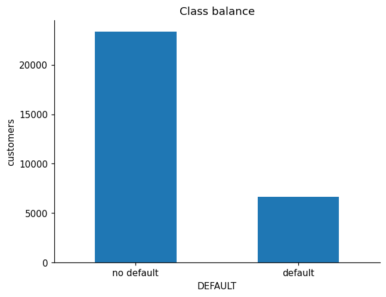

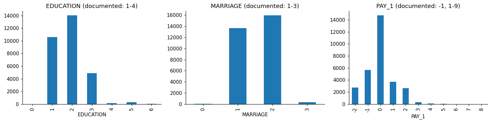

Last month's repayment status is by far the strongest raw signal:

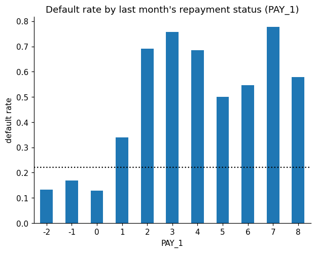

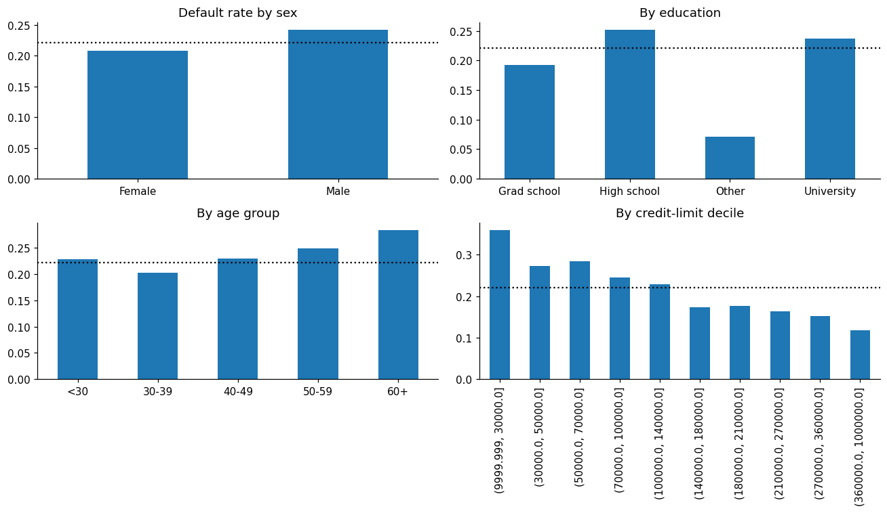

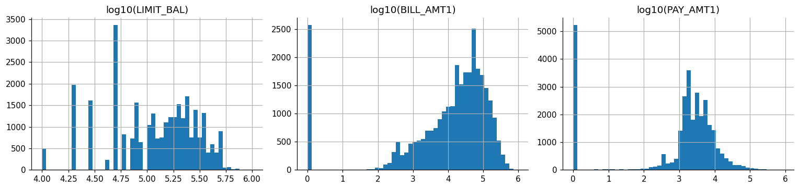

---

## Approach

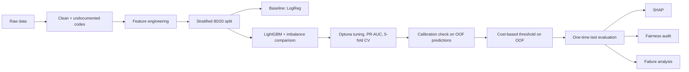

The 20% test set is used **once**. Model choice, tuning, calibration and the threshold all use cross-validation on the training set, so no test information leaks into any decision.

---

## Results in detail

### 1. Baseline and feature engineering

5-fold stratified CV on the training set (mean ± SD across folds):

| Model | ROC-AUC | PR-AUC | Brier |
|---|---|---|---|
| Logistic regression, raw features | 0.723 ± 0.009 | 0.503 ± 0.013 | 0.1451 |
| Logistic regression, engineered features | 0.763 ± 0.008 | 0.513 ± 0.014 | 0.1401 |
| LightGBM (default), engineered features | 0.785 ± 0.009 | 0.559 ± 0.013 | 0.1341 |

- Engineered features (utilisation, repayment-to-bill ratios, delinquency counts and trends) lifted logistic regression's ROC-AUC by **+0.040**. The PR-AUC change (+0.011) is within noise.
- Moving to a non-linear model added **+0.022 ROC-AUC and +0.046 PR-AUC**, mostly at the top of the ranking, which is where the flagging decision lives.

### 2. Imbalance handling

Same LightGBM settings for each strategy; SMOTE runs inside a pipeline so synthetic rows never leak across folds.

| Strategy | ROC-AUC | PR-AUC | Brier |
|---|---|---|---|
| **Plain** | 0.785 ± 0.009 | 0.559 ± 0.013 | **0.134** |
| Class weights | 0.784 ± 0.010 | 0.560 ± 0.013 | 0.168 |
| SMOTE | 0.774 ± 0.008 | 0.536 ± 0.010 | 0.143 |

Class weights are a tie on ranking (0.0003 PR-AUC difference, far inside the noise) but distort probabilities. SMOTE is worse on both. Plain training was selected (a rule prefers it unless an alternative wins PR-AUC by at least 0.002).

### 3. Final model performance

Optuna (TPE sampler) tuned LightGBM for cross-validated **PR-AUC**, which is more informative than ROC-AUC with a 22% positive class.

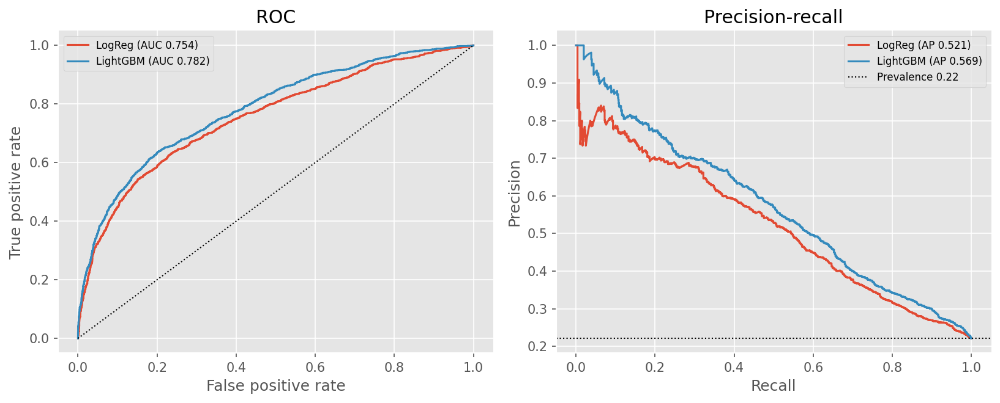

| Optimisation history | Parameter importance |
|---|---|
| 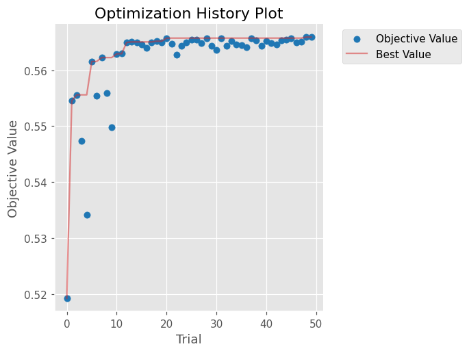 | 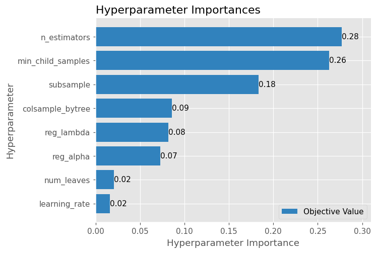 |

### 4. Calibration

A lender uses the probability itself (expected loss, limits), so it must be trustworthy. Calibrators were fit on out-of-fold predictions and scored with cross-fitting:

| Method | ROC-AUC | PR-AUC | Brier | ECE |
|---|---|---|---|---|
| **None (raw)** | 0.7895 | 0.5639 | **0.1328** | 0.0050 |
| Platt | 0.7894 | 0.5632 | 0.1329 | 0.0044 |
| Isotonic | 0.7871 | 0.5552 | 0.1331 | 0.0049 |

The tuned model is already well calibrated, so **no calibration layer was added** (the pipeline only calibrates if Brier improves by at least 0.0002).

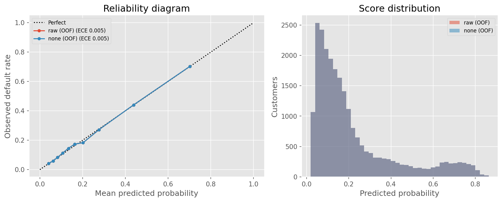

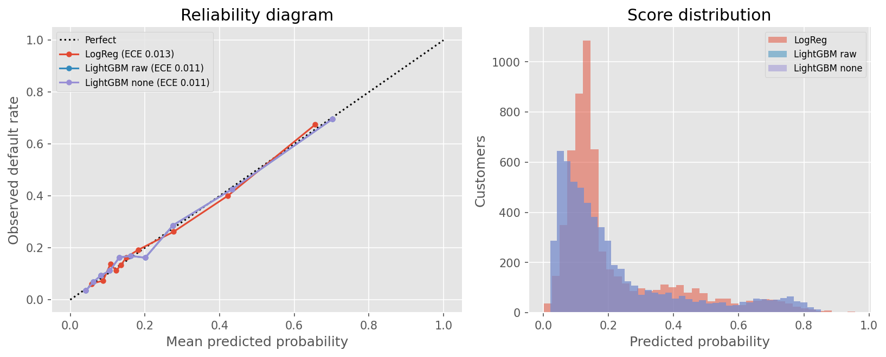

### 5. Cost-based decision threshold

Assumption: a **missed defaulter costs 5×** a false alarm (no early outreach vs a needless limit cut or call). For calibrated probabilities the optimal rule is "flag if p > c_fp / (c_fp + c_fn)" = 1/6 ≈ 0.167. The empirical optimum, chosen on out-of-fold scores, is **0.15**.

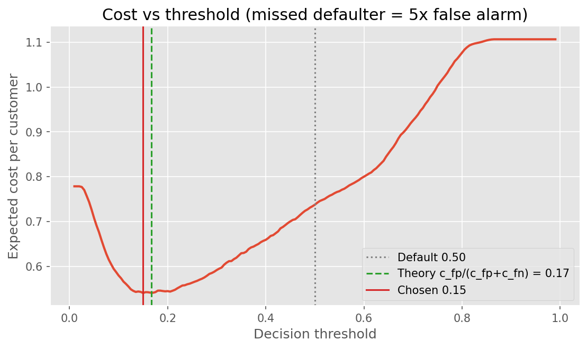

Test-set policy comparison (cost per customer, false alarm = 1):

| Policy | Cost / customer | Flag rate | Recall | Precision |
|---|---|---|---|---|
| Flag nobody | 1.106 | 0% | 0% | n/a |
| Flag everybody | 0.779 | 100% | 100% | 22.1% |
| Model @ 0.50 (default) | 0.745 | 11.9% | 36.2% | 67.0% |
| **Model @ 0.15 (cost-optimal)** | **0.562** | 48.5% | 77.5% | 35.3% |

The 0.50 threshold barely beats "flag everybody" because misses are expensive. The model's value is concentrating effort on the riskiest customers.

**The 5× ratio is an assumption**, so the sensitivity matters (threshold picked on out-of-fold data, evaluated on test):

| Cost ratio | Threshold | Theory | Flag rate | Recall | Cost / customer |
|---|---|---|---|---|---|
| 2× | 0.310 | 0.333 | 22.1% | 53.8% | 0.307 |
| 3× | 0.260 | 0.250 | 26.0% | 58.8% | 0.403 |
| **5×** | **0.150** | **0.167** | **48.5%** | **77.5%** | **0.562** |
| 10× | 0.090 | 0.091 | 71.5% | 91.6% | 0.699 |
| 20× | 0.045 | 0.048 | 93.9% | 98.9% | 0.767 |

The empirical threshold tracks theory at every ratio, which supports the calibration. But the share of customers flagged swings from 22% to 94%, so the business must fix the cost ratio and its intervention capacity before deployment.

### 6. Explainability (SHAP)

SHAP values are computed on the raw model output (log-odds). Calibration is monotone, so the ranking and the direction of effects are unaffected.

| Feature | Mean \|SHAP\| |
|---|---|
| `PAY_MAX` | 0.368 |
| `PAY_1` | 0.278 |
| `BILL_AMT1` | 0.098 |
| `BILL_MEAN` | 0.070 |
| `LIMIT_BAL` | 0.069 |
| `PAYAMT_MEAN` | 0.068 |
| `PAY_AMT1` | 0.068 |
| `PAY_AMT2` | 0.064 |
| `UTIL_2` | 0.060 |
| `N_DELAYED` | 0.056 |

Recent delinquency dominates (`PAY_MAX` includes `PAY_1`, so the two share credit as one signal). Half of the top 10 are engineered features.

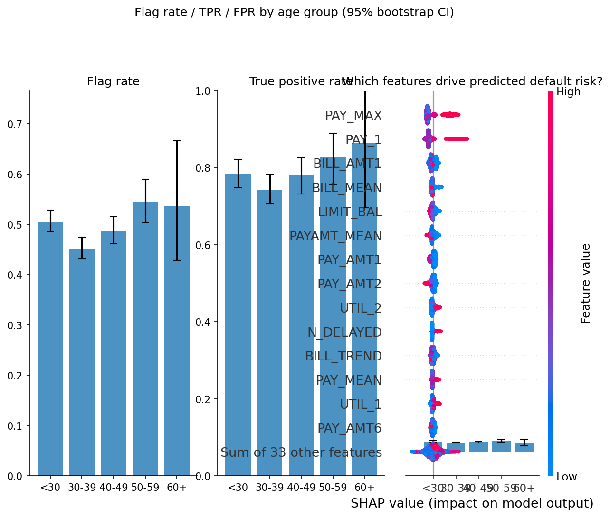

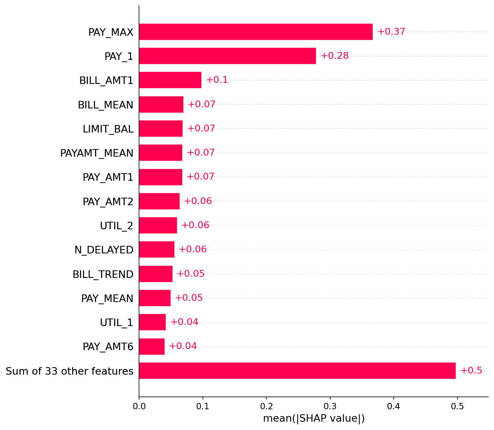

**Individual explanations.** These waterfall plots answer "why was this customer flagged?", which is what a customer or regulator asks for:

| Caught defaulter (true positive) | Missed defaulter (false negative) |
|---|---|
| 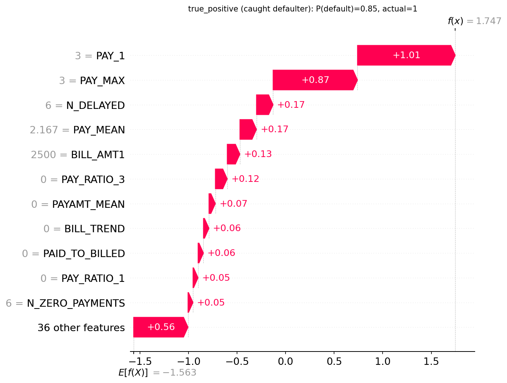 | 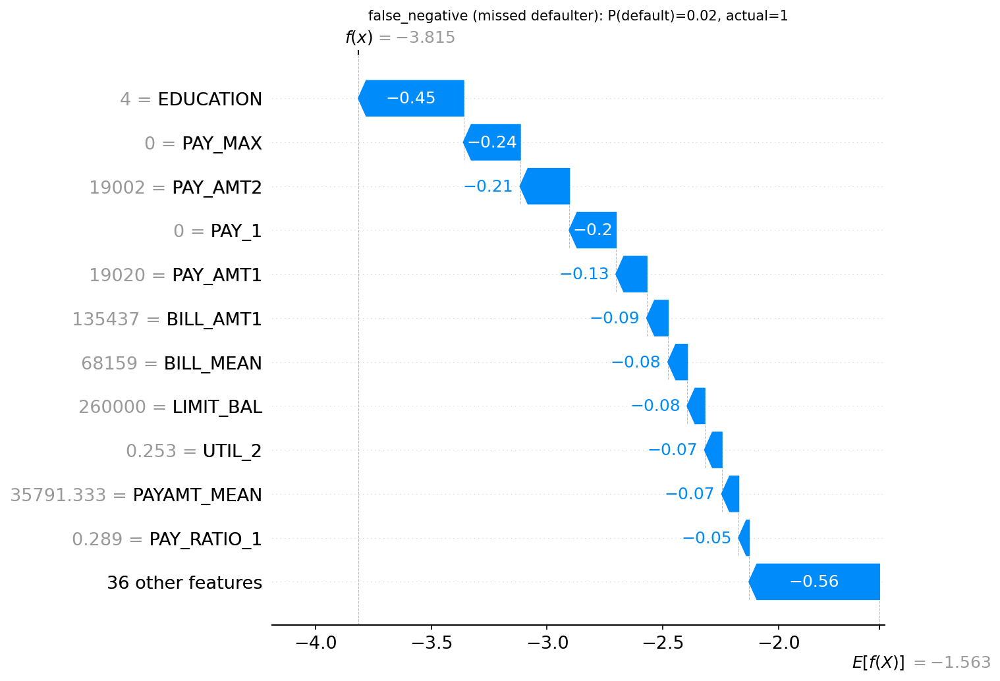 |

| False alarm (false positive) | Safe customer (true negative) |
|---|---|
| 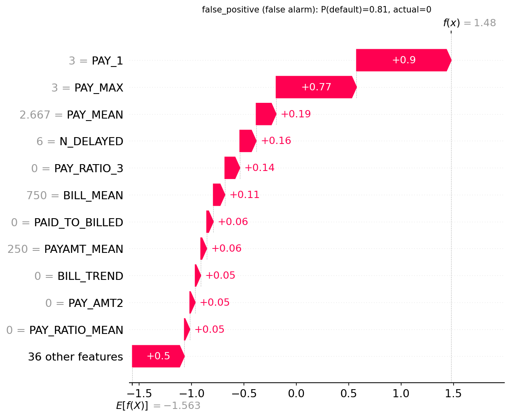 | 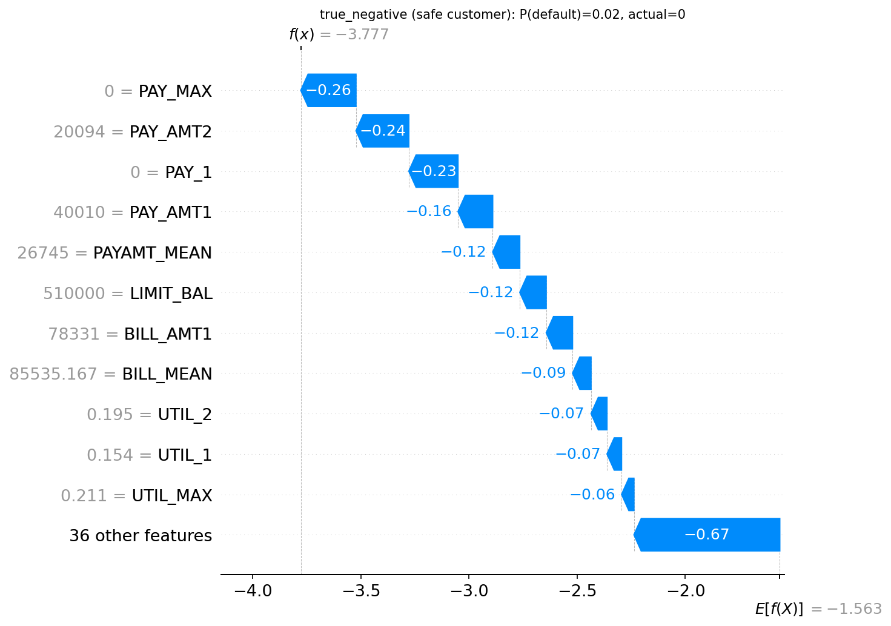 |

### 7. Fairness audit

**Setup.** SEX and MARRIAGE are **not** model inputs. AGE and EDUCATION are inputs, and all four attributes are audited. The "decision" is the flag (early intervention), so a higher flag rate is the burden that group bears. Metrics: flag rate, TPR, FPR, PPV and calibration by group, with 95% bootstrap confidence intervals.

> Calibration holds within every group with n ≥ 1,000 (|calibration gap| ≤ 0.02), so a score means about the same risk for everyone. Error rates still differ, in line with base-rate differences. When base rates differ, calibration and equal error rates cannot all hold at once (Chouldechova 2017; Kleinberg et al. 2016).

**By sex** (test set):

| Group | n | Default rate | Flag rate | TPR | FPR |
|---|---|---|---|---|---|
| Female | 3,661 | 20.7% | 46.9% (45.4 to 48.6) | 78.6% (75.9 to 81.4) | 38.7% (36.8 to 40.5) |
| Male | 2,332 | 24.4% | 51.1% (49.1 to 53.1) | 76.1% (72.8 to 79.6) | 43.0% (40.7 to 45.0) |

Men default more often and are flagged more often, with more false alarms. The 2.5-point TPR gap is within bootstrap noise.

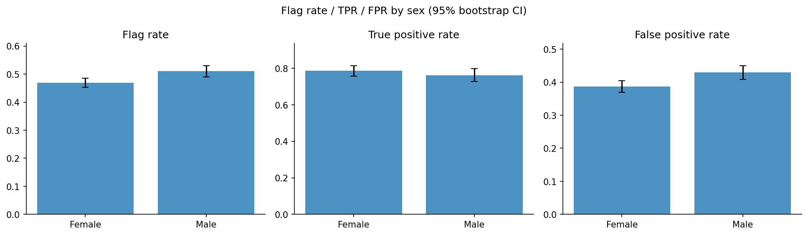

**By age group:**

| Group | n | Default rate | Flag rate | TPR | FPR |
|---|---|---|---|---|---|
| <30 | 1,927 | 21.7% | 50.5% | 78.5% | 42.8% |
| 30-39 | 2,208 | 20.8% | 45.2% | 74.3% | 37.5% |
| 40-49 | 1,298 | 23.3% | 48.7% | 78.2% | 39.7% |
| 50-59 | 493 | 24.9% | 54.6% | 82.9% | 45.1% |
| 60+ | 67 | 32.8% | 53.7% | 86.4% | 37.8% |

The 30-39 group is flagged least and the 50-59 group most. The 60+ group (n=67) has confidence intervals so wide (TPR 70% to 100%) that no conclusion is possible.

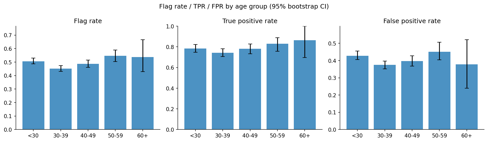

**By education**: the largest and clearest gap. Confidence intervals for grad school and high school do not overlap on any metric:

| Group | n | Default rate | Flag rate | TPR | FPR |
|---|---|---|---|---|---|
| Grad school | 2,090 | 17.9% | 42.4% (40.5 to 44.5) | 69.3% (64.5 to 73.4) | 36.5% (34.4 to 38.9) |
| University | 2,769 | 24.2% | 52.0% (49.9 to 53.7) | 80.3% (77.2 to 83.2) | 42.9% (40.7 to 45.1) |
| High school | 1,044 | 26.3% | 55.0% (52.0 to 58.4) | 82.9% (79.0 to 87.9) | 45.0% (41.9 to 48.3) |
| Other (n=90) | 90 | 5.6% | too small to interpret | | |

This is partly explained by base rates, but EDUCATION is a model input and a plausible proxy for socioeconomic status, so it deserves scrutiny.

**Marital status** (not a model input): married and single customers have near-identical flag rates (48.8% and 48.1%).

**Does removing SEX make the model blind to it?** No. SEX can be predicted from the remaining model features with **AUC 0.60** (0.5 = no information). Dropping SEX cost no accuracy and did not materially change group error rates (both models at the same overall flag rate):

| Model | ROC-AUC | PR-AUC | Flag-rate ratio | TPR gap | FPR gap |
|---|---|---|---|---|---|
| Without SEX (ours) | 0.7817 | 0.5691 | 0.919 | 0.025 | 0.043 |
| With SEX | 0.7820 | 0.5697 | 0.902 | 0.011 | 0.051 |

The differences are within bootstrap noise. Removing a protected attribute is the right default, but it is not a fairness guarantee.

**What would mitigation cost?** An exploratory experiment sets group-specific thresholds so that TPR is equal across sexes:

| Policy | TPR gap | FPR gap | Flag-rate ratio |
|---|---|---|---|
| Single global threshold | 0.025 | 0.043 | 0.919 |
| Group-specific thresholds (equal TPR) | 0.0004 | 0.070 | 0.870 |

Equalising TPR closes that gap but **widens the FPR gap and the flag-rate disparity**. Fixing one criterion worsens another. (The thresholds were fit on the same data they were evaluated on, so the small cost change should be read as "no meaningful difference".)

**What I would and would not do**

*I would:* exclude SEX and MARRIAGE; monitor all four attributes after deployment; report gaps with confidence intervals; test whether EDUCATION and AGE should be inputs at all; make the flag a supportive intervention (payment plan, outreach) rather than an adverse action where possible; keep a human in the loop for limit reductions and give customers the reasons behind a decision.

*I would not:* use group-specific thresholds on a protected attribute (disparate treatment, generally unlawful for sex in EU credit and insurance pricing since the CJEU's *Test-Achats* ruling and under US ECOA); claim the model is "fair" because SEX is removed; or optimise a single fairness metric blindly. The choice between conflicting criteria is a policy decision for risk, legal and compliance teams. *This is analysis, not legal advice.*

### 8. Failure analysis

The model missed **298 of 1,326 defaulters (22.5%)**.

- **97.3%** of the missed defaulters were current on payments the previous month (`PAY_1 ≤ 0`), and **94.3%** had no delayed month in the whole six-month window.
- The ten most confident misses all have no delay history, scores of 0.02 to 0.04 and mostly high credit limits. They look like safe customers who defaulted anyway.
- Customers 2 or more months late are flagged 100% of the time (default rate about 68%). The 4,654 customers with `PAY_1 ≤ 0` have default rates of only 13% to 16% but miss rates of 36% to 50%.

| `PAY_1` | n | Default rate | Flag rate | Miss rate | False-alarm rate |
|---|---|---|---|---|---|
| -2 | 583 | 13.4% | 33.8% | 50.0% | 31.3% |
| -1 | 1,154 | 16.0% | 42.4% | 36.2% | 38.3% |
| 0 | 2,917 | 13.6% | 32.3% | 46.5% | 29.0% |
| 1 | 718 | 33.4% | 91.9% | 3.3% | 89.5% |
| 2 | 523 | 68.3% | 100% | 0% | 100% |
| 3+ | 98 | about 71% | 100% | 0% | 100% |

Missed defaulters had almost no delays (average 0.06 delayed months vs 2.57 for caught defaulters), though that comparison is partly circular: caught defaulters are caught because of their delays. The takeaway is that the model is a **delinquency detector**. Sudden shocks (job loss, illness) leave no trace in six months of payment history. Income, employment or credit-bureau data would be the first thing to add.

---

## Key design decisions

| Decision | Reason |
|---|---|
| PR-AUC as the tuning objective | With a 22% positive class it reflects the flagging decision better than ROC-AUC or accuracy (a "nobody defaults" model scores 78% accuracy) |
| Stratified 80/20 split, test set used once | Prevents any leakage into model, calibration or threshold choices |
| Calibrators and threshold fit on out-of-fold predictions | Tuning decisions never see the test set |
| SMOTE inside a CV pipeline | Oversampling before CV leaks synthetic rows and inflates scores |
| "Plain" preferred unless an alternative wins by a margin | Simplest model that is not clearly beaten |
| Cost-based threshold with a sensitivity table | The cost ratio is a business assumption, so show the consequences of changing it |
| SEX and MARRIAGE excluded; all four attributes audited | Unawareness is a default, and the audit shows what it does and does not achieve |
| Bootstrap CIs on every fairness number | Small groups give noisy gaps |

---

## Limitations

- **Old, single-market data** (Taiwan, 2005). Patterns will not transfer to other markets or to current behaviour.
- **No time dimension**, so no out-of-time validation. Random cross-validation likely overstates real-world performance.
- **Selection bias.** Only customers who were granted credit are observed, and credit limits already reflect the lender's earlier decisions.
- **Limited features.** No income, employment or bureau data. The model cannot anticipate shocks.
- **Coarse group definitions.** Sex is binary in the data, and intersectional effects (such as sex × age) are not audited. Groups with n < 100 are not interpretable.
- **Cost ratio is assumed**, not estimated from real intervention economics.
- **SHAP explains the model, not causality.** Correlated features share credit.
- **Hyper-parameters and numbers** depend on the Optuna run and random seed. Re-running with a different trial count shifts results slightly.

---

## Reproduce it

Requires Python 3.10 to 3.12.

```bash
# 1. Environment
python -m venv .venv
source .venv/bin/activate          # Windows: .venv\Scripts\activate
pip install -r requirements.txt

# 2. Data: see data/README.md, then put the file in data/
#    data/default_of_credit_card_clients.xls

# 3. Headless pipeline: writes tables to reports/tables/ and a model to artifacts/
python -m src.train --data data/default_of_credit_card_clients.xls --n-trials 50

# 4. Notebooks: run in order with Restart & Run All (they write the figures to reports/figures/)
jupyter lab notebooks/

# 5. Tests (synthetic data, no download needed)
python -m pytest tests
```

If you use Jupyter, register the virtual environment as a kernel so the notebooks see the installed packages:

```bash
pip install ipykernel
python -m ipykernel install --user --name credit-default --display-name "Python (credit-default)"
```

---

## Repository structure

```
credit-default-explainability/
├── README.md
├── MODEL_CARD.md
├── requirements.txt
├── data/                     gitignored; download instructions in data/README.md
├── notebooks/
│   ├── 01_eda.ipynb                       class balance, data quality, signal
│   ├── 02_modeling.ipynb                  baseline, imbalance, tuning, calibration, cost threshold
│   └── 03_explainability_fairness.ipynb   SHAP, fairness audit, failure analysis
├── src/
│   ├── features.py           loading, data-quality report, cleaning, feature engineering
│   ├── train.py              models, CV comparison, Optuna, end-to-end pipeline (CLI)
│   ├── calibration.py        calibrators (own module so saved models unpickle cleanly)
│   ├── evaluate.py           metrics, calibration plots, cost curves, failure analysis
│   ├── fairness.py           group metrics, bootstrap CIs, proxy test, mitigation experiment
│   └── explain.py            SHAP global and local plots
├── tests/                    smoke tests on synthetic data
├── artifacts/                gitignored; trained model and predictions
└── reports/
    ├── figures/              all plots used in this README
    └── tables/               CSV outputs of the pipeline
```

---

## References

- Yeh, I-C. and Lien, C-H. (2009). The comparisons of data mining techniques for the predictive accuracy of probability of default of credit card clients. *Expert Systems with Applications*, 36(2).
- Ke, G. et al. (2017). LightGBM: A highly efficient gradient boosting decision tree. *NeurIPS*.
- Akiba, T. et al. (2019). Optuna: A next-generation hyperparameter optimization framework. *KDD*.
- Lundberg, S. and Lee, S-I. (2017). A unified approach to interpreting model predictions. *NeurIPS*.
- Chouldechova, A. (2017). Fair prediction with disparate impact. *Big Data*, 5(2).
- Kleinberg, J., Mullainathan, S. and Raghavan, M. (2016). Inherent trade-offs in the fair determination of risk scores.
- Mitchell, M. et al. (2019). Model cards for model reporting. *FAT\**.

---

*Author: `Nikita_M` · License: `MIT` · Not legal or financial advice.*
